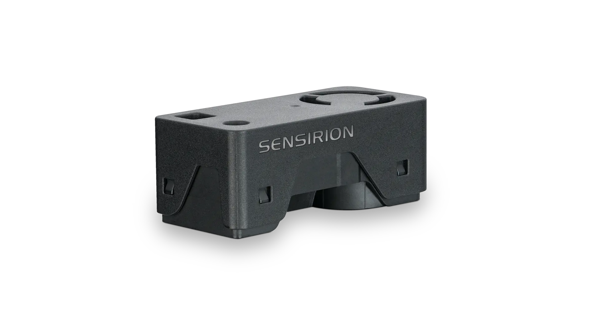

# Sensirion I2C SEN6x Driver

This library provides an embedded `no_std` driver for the [Sensirion SEN6x series](https://developer.sensirion.com/product-support/sen6x-environmental-sensor-node).
This driver was built using [embedded-hal](https://docs.rs/embedded-hal/) traits.

This driver is compatible with `embedded-hal v1.0`.

## Features

- **`embedded-hal`** - Enables async I2C support via `embedded-hal`.
- **`embedded-hal-async`** - Enables async I2C support via `embedded-hal-async`.
- **`embassy`** - Enables shared I2C bus support using `embassy::embassy_sync::mutex::Mutex`. This option enables `embedded-hal-async`

```toml
[dependencies]
sen6x = { version = "0.0.1", features = ["embassy"] }
```

## Sensirion SEN6x

The SEN6x sensor module family is an air quality platform that combines critical parameters such as particulate
matter, relative humidity, temperature, VOC, NOx and either CO2 or formaldehyde, all in one compact package.



Further information: [Datasheet SEN6x](https://sensirion.com/media/documents/FAFC548D/693FBB15/PS_DS_SEN6x.pdf)

## GenAI Usage

This project was created with the assistance of Claude and Gemini. Primarily, GenAI is used to:
- Generate documentation
- Check code against the datasheet
- Fix warnings and clean up code

## License

Licensed under [MIT license](LICENSE)

### Contributing

Unless you explicitly state otherwise, any contribution intentionally submitted
for inclusion in the work by you, shall be licensed under MIT License, without any additional terms or conditions.